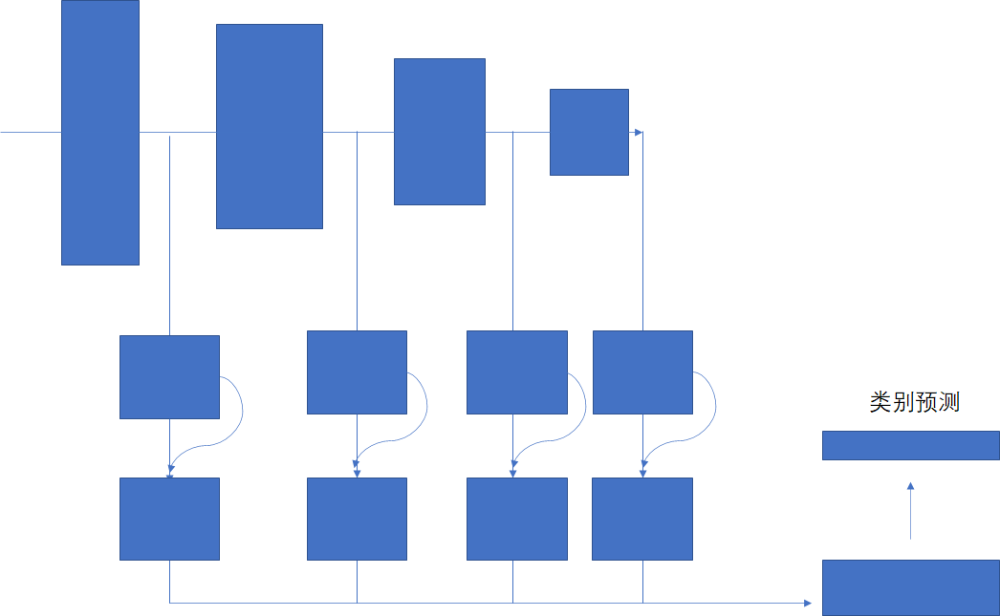
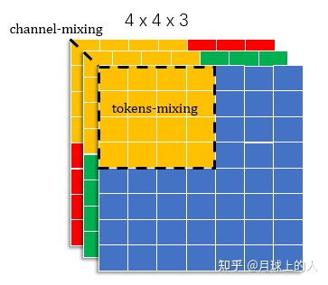

#### 1. 介绍

---

##### 1.1. Motivation

消化道粘膜下病变（SMTs）是指来源于消化道粘膜层以下各层次的病变，因它们在内镜下都表现为粘膜正常的隆起性病变，普通的内镜检查技术无法判断它的来源层次及性质。因此，在利用白光内镜找到粘膜正常的隆起性病变后，需要结合其他成像手段来进一步判断肿瘤的类别。其中EUS便是目前评估消化道SMT最准确的影像学方法之一，在EUS的成像过程中，换能器通过发送短脉冲，超声能量进入组织并接收组织反射信号形成组织的超声图像。而SMTs在EUS成像下通常呈现出1-5层环状层次结构，并在肿瘤区域表现为对层次结构的破坏，临床医生通常依靠观察这些病变的起源层次及其在超声内镜表现来做出诊断。常见的消化道SMTs共有5种，包含胃肠道间质瘤，异位胰腺，脂肪瘤，平滑肌瘤，神经内分泌肿瘤。然而，EUS的图像内容复杂多变，基于EUS的SMTs诊断具有陡峭的学习曲线，基于计算机辅助的诊断有着重要的研究意义。

基于EUS的SMTs识别共存在以下几大挑战。首先，SMTs的诊断需要依靠不仅需要对肿瘤区域的表现进行分析，还必须依靠肿瘤的起源层次来判断肿瘤的类别，而起源层次的判断则需要依靠对层次结构的理解，而EUS图像对于组织结构的反映情况随着人体环境及EUS的操作而异，其有效层次结构的信息提取困难。其次，在EUS的成像中，伪像，噪声等干扰信息进一步增加了SMTs识别过程中特征提取的挑战。最后，EUS图像具有复杂的空间语义关系（例如起源层次），这些负责语义关系为临床医生提供了更加丰富的信息，但也进一步增加了计算机辅助SMTs识别的难度。

近年来，随着深度学习技术的发展，卷积神经网络（CNN）作为一种learning-based方法，在自然图像处理领域取得了巨大的进展。而在医学图像上，CNN同样取得了显著的成果。CNN通过利用图像数据与优化算法，自适应地学习网络参数并获得数据的有用表示，以在预测阶段完成对任务目标的逼近，常见的任务有图像分类，目标检测，语义分割等。然而，目标检测及语义分割任务需要预先获取目标级别的数据标注作为模型学习的监督信息，该标注对于EUS成本昂贵，难以获得。此外，基于CNN的方法虽然具有强大的数据表示学习能力，这种方法通常缺乏决策结果的可解释性，从而影响模型决策的可信度。

针对上述挑战，本文提出了一种基于CNN的SMTs图像分类方法，共包含两部分内容：（1）为引导CNN学习理解EUS中的层次结构区域，基于层次区域图像内容修复的辅助任务，提出了一种适用于EUS图像的自监督预训练方法，在不引入额外标注的情况下使模型能够预先感知EUS的结构信息，从而帮助CNN模型在下游的分类任务中更快更准确地找到感兴趣区域。（2）为充分利用EUS中复杂的空间语义关系，提出了一种多尺度关系注意力网络，以VGG-16作为backbone模型，在CNN不同尺度中加入所提出的关系注意力模块，自适应的学习不同层级的空间语义关系。实验部分，我们构建了一份包含4,000+的数据集（xx）来验证所提的方法，该数据包含5类粘膜下肿瘤，来自480个不同的病人。此外，为增强CNN模型决策结果的解释性，我们采用了Occlusion-based methods与Grad-CAM方法，对决策结果进行可视化分析。

本文的组织如下，在第二节介绍相关工作，第三节介绍方法，第四节介绍实验，第五节则给出结论及展望。


#### 2. 相关工作

---

##### 2.1. 细粒度图像分类


##### 2.2. 自监督学习

CNN相关研究近年来发展迅速，其在工业界的应用也越加广泛，然而，there are many cases of industrial applications that still suffer from the hard accessibility of  data annotations. 比如医疗领域，由于医疗影像判读的专业性强，其细粒度的标注通常成本昂贵。自监督学习的提出，旨在充分利用数据自身的信息，设计特定的辅助任务来指导模型掌握特定的能力。


##### 2.3.  注意力机制

 


#### 3. 方法

---

##### 3.1. Overall framework


##### 3.2. 关系感知的自监督预训练方法

```python
Input：Image 
Do... while


```

##### 3.2. 多尺度关系注意力网络

##### 3.2.1. 整体结构



##### 3.2.2. 关系注意力模块

- 绘图参考




#### 4. 实验

---

##### 4.1. 实验设置

