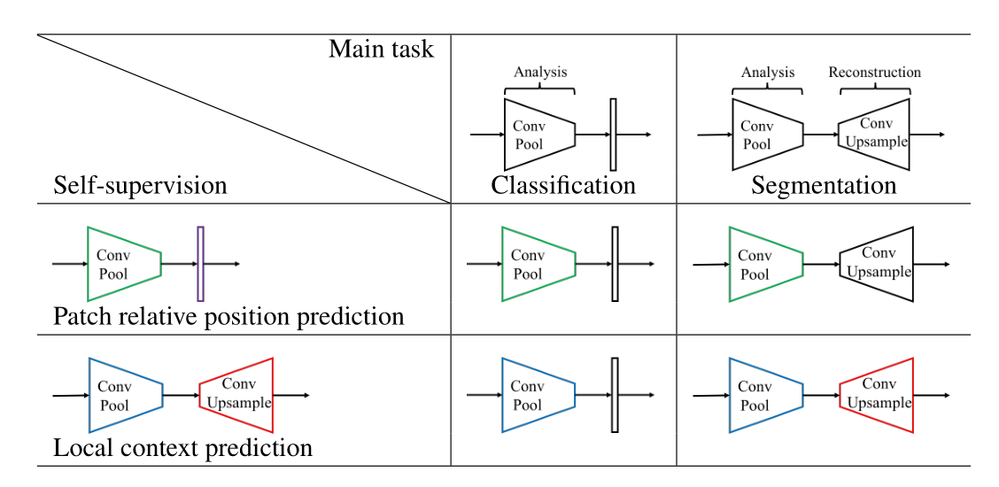
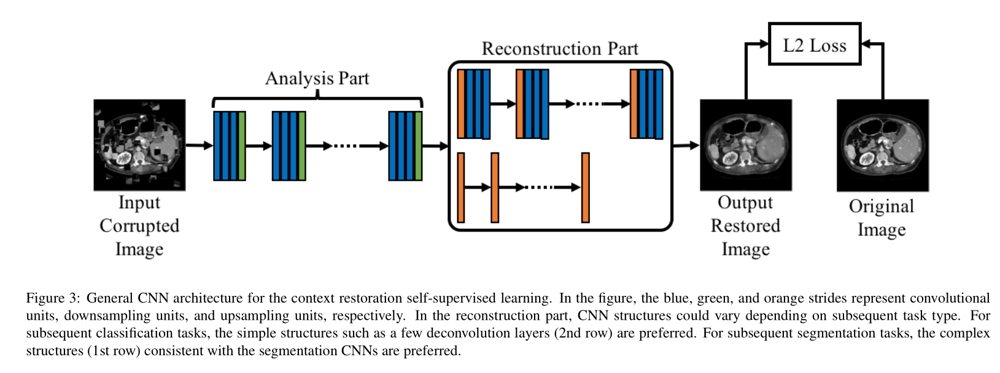
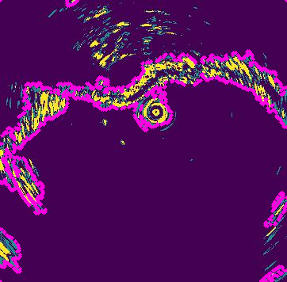

# How Transferable Are Self-supervised Features in Medical Image Classification Tasks
---

Early applications design tailored pretext tasks to reconstruct images from transformed or distorted inputs [ 6 , 7 , 9 –12 , 22 ]. For example, Model Genesis [ 6 ] applies in-domain transfer learning to various classification and segmentation tasks on CT and X-ray images. The proposed architecture is an autoencoder that reconstructs images from four transformations, namely non-linear, local-shuffling, out painting, and in-painting. The induced transformations are supposed to enable the encoder to learn features related to appearance, texture, and context. Chen et al. [ 7 ] propose ==context restoration== as a pretext task applied in three common medical use cases: plane detection on fetal 2D ultrasound images, abdominal organ localization on CT images, and brain tumor segmentation on MRI images. The proposed method generates distorted images with different spatial contexts while maintaining the same intensity distribution by repeatedly swapping two random patches in an input image. Through reconstruction, the model learns useful semantic features transferable in subsequent target classification and segmentation tasks. Alternatively, several works [ 9 , 10 ] tailor the pretext tasks as solving Jigsaw puzzles and Rubik cubes. Taleb et al.[ 9 ] create puzzles made of patches fused from different modalities, e.g., different MRI modes, of the same structure and trains a construction task to reassemble the shuffled patches. Likewise, in 3D images, Zhuang et al. [ 10 ] rearrange and rotate the CT volumes, driving the model to learn features invariant to translation and rotation. The pretrained features are transferred to solve brain hemorrhage classification and tumor segmentation tasks. The limitation of handcrafted pretext tasks is that they are highly task- and domain-specific, and thus cannot generalize well to different tasks.

[6] Models Genesis: Generic Autodidactic Models for 3D Medical Image Analysis

[7] Self-supervised learning for medical image analysis using image context restoration

[9] Multimodal Self-Supervised Learning for Medical Image Analysis

[10] Self-supervised Feature Learning for 3D Medical Images by Playing a Rubik’s Cube

[12] Divide-and-Rule: Self-Supervised Learning for Survival Analysis in Colorectal Cancer.

[22] Modeling Disease Progression in Retinal OCTs with Longitudinal Self-supervised Learning

---

##  Self-supervised learning for medical image analysis using image context restoration

**Loss Function**: We propose to use the L2 loss for training the CNNs for the task of context restoration. As suggested by (Pathaketal.,2016), the L2 loss is sufficient for feature learning although the outputs from context restoration outputs may be blurry.

**Implementation**: In this work, the CNNs for context restoration employ single convolution layers as the convolutional units. In the analysis part, the architecture is similar to that of the VGG-Net (Simonyan and Zisserman, 2014), where there is a pooling layer following a few convolution layers. In the reconstruction part, ==if the subsequent task is a classification task==, then there are ==only a few deconvolution layers==; if the subsequent task is segmentation, then the reconstruction part is in symmetry with the analysis part with concatenation connections, which is similar to a U-Net architecture (Ronneberger et al., 2015). The loss function of CNNs in the subsequent tasks is the cross-entropy function.

---

### 预处理

